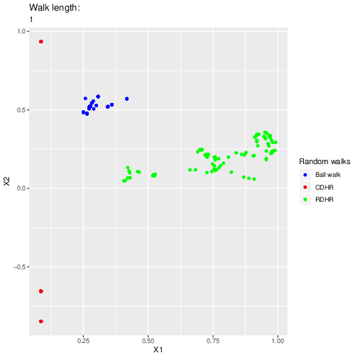
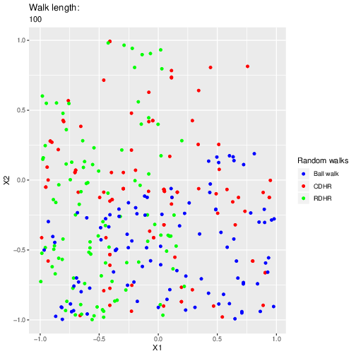
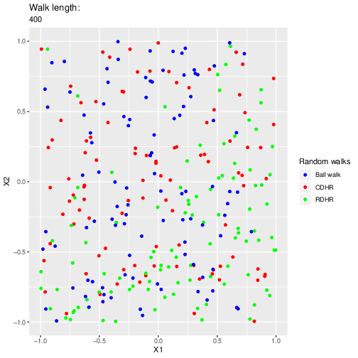

# Solutions for GeomScale GSoC tests

This repo contains my solutions [these
tests](https://github.com/GeomScale/gsoc2020/wiki/Efficient-MCMC-sampling-based-on-the-underdamped-Langevin-diffusion#tests).

## Easy test

This code demonstrates the mixing of different random walks implemented in VolEsti.

## Medium test

This test is about sampling from a log-concave distribution given by a strongly
convex function, using the ball walk. In the code, this is demonstrated with a
normal (gaussian) distribution.

## Hard test

An implementation of gradient descent with the [Barzilai-Borwein
step](https://www.math.ucla.edu/~wotaoyin/math273a/slides/Lec4a_Baizilai_Borwein_method_273a_2015_f.pdf).
